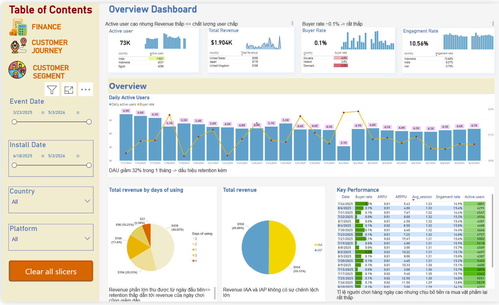
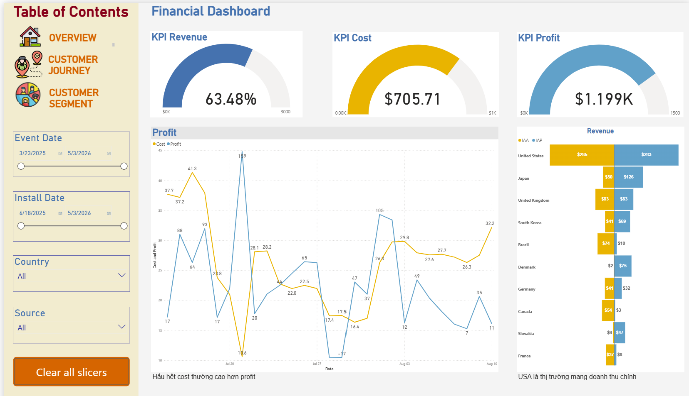
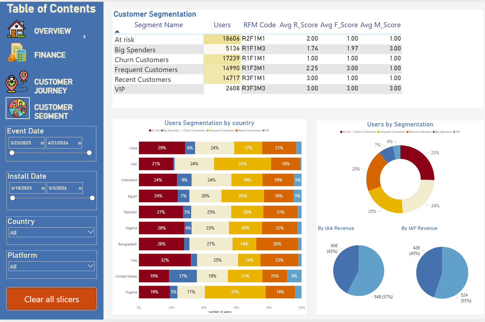

# 🎮 Hospital Frenzy Analytics: User Behavior & Monetization Intelligence

## 📌 1. Project Overview & Objectives

**Domain:** Mobile Gaming / Product Analytics / Monetization Strategy

**Objective:**
This project aims to analyze user behavior, revenue performance, and marketing efficiency of the *Hospital Frenzy* mobile game. The goal is to uncover key issues in retention and conversion, and provide actionable insights to optimize product experience and monetization.

**Data Scope:**

* Timeframe: **July 2025-August 2025**
* Dataset includes full user lifecycle:

  * Onboarding (tutorial)
  * Gameplay progression (levels)
  * Ad interactions
  * In-app purchases (IAP)
  * Marketing costs

**Scale:**

* \~73K users
* \~2.6M tutorial events
* \~1.77M level completions
* \~337K ad impressions

**Key Challenges:**

* The product demonstrates strong user acquisition, yet fails to translate scale into revenue, with \~73K users generating only \~$1.9K
* User base is heavily concentrated in low-monetization markets
* Significant mismatch between user growth and monetization performance
* Revenue model is highly concentrated, relying on a small segment of high-value users

**Expected Output:**

An end-to-end analytics solution that includes interactive dashboards to monitor user behavior, revenue, retention, and market performance, combined with deep-dive analysis (funnel, cohort, and RFM) to uncover key gaps in retention, conversion, and monetization, and deliver actionable strategies to optimize product experience, monetization, and growth.

---

## 🛠️ 2. Tech Stack & Tools

* **Data Extraction & Transformation:** CSV ingestion via Power BI (Power Query); prior experience with Google BigQuery (SQL).
* **Data Visualization & Storytelling:** Power BI (DAX, Interactive Dashboards, KPI modeling).
* **Exploratory Data Analysis (EDA):** Conducted directly within Power BI.
* **Analytics Methods:** Cohort Analysis, Retention Analysis, RFM Segmentation.

## 🗄️ 3. Data Architecture & Modeling

The system follows an **event-based data model**, where each table represents a type of user action.

### 📂 Tables Overview

| Table           | Records   | Description           |
| --------------- | --------- | --------------------- |
| tutorial        | 2,591,524 | Onboarding behavior   |
| level_end       | 1,772,341 | Level completion data |
| ad_impression   | 337,602   | Ad interaction data   |
| in_app_purchase | 237       | IAP revenue           |
| cost            | 27        | Marketing cost        |

### 🔗 Data Relationships

* Each table has a **1-N relationship with users**
* A user can:

  * Complete multiple tutorial steps
  * Play multiple levels
  * View multiple ads
  * Make multiple purchases

### Data Modeling
To support analysis and dashboarding, multiple event tables were consolidated into a **unified event-level dataset**.

Specifically, user activity from different sources — including **tutorial (onboarding)** and **level progression** events — was standardized and merged with monetization data (**in-app purchases and ad impressions**) into a single table.

This unified structure enables:

* A complete view of the **user lifecycle** (onboarding → gameplay → monetization)
* Simplified KPI calculations (DAU, revenue, retention)
* Efficient dashboard development in Power BI

**Key Transformations:**

* Standardized user identifier using `advertising_id` (fallback from `vendor_id`)
* Cleaned invalid/missing values (e.g., country normalization → “Unknown”)
* Unified event schema across:

  * Engagement events (tutorial, level_end)
  * Revenue events (IAP, IAA)
* Derived additional fields:

  * `install_date` (first activity per user)
* Filtered valid data by app version and time range

👉 **Result:**
A single **event-based analytical table** that serves as the foundation for all dashboards and analyses.

---

## 📊 4. Business Intelligence Dashboards & Deep Analytics

👉 **[Click here to view Interactive Power BI Dashboard](https://app.powerbi.com/view?r=eyJrIjoiY2QzNGY1YzUtYTYwMi00ODE0LTgzYjgtMjU2MWRmZjZjMGM2IiwidCI6IjVlOGIzMjY5LTc2Y2EtNDU3Yy04NDdmLTQ0NGUzZGI5ODZhNyIsImMiOjl9)**

---

### 🔹 Layer 1: The Big Picture (Overview)

At first glance, *Hospital Frenzy* appears to have successfully acquired a sizable user base (\~73K users). However, a deeper look at daily activity reveals a concerning trend: **DAU declined sharply from 6.9K to 4.7K (\~-32%) within a short period**, with an extreme drop to **2.1K on Aug 1, 2025**.

This pattern suggests that while user acquisition is effective, **the product struggles to sustain user engagement over time**. The volatility in DAU may indicate inconsistencies in marketing campaigns or potential product/technical disruptions.

👉 **So what?**

The growth is largely **top-heavy and unsustainable**, as newly acquired users fail to convert into stable active users.

---

### 🔹 Layer 2: Financial Performance

Despite a relatively large user base, total revenue remains disproportionately low (\~$1.9K), indicating weak monetization performance. While revenue is evenly split between Ads (IAA) and In-App Purchases (IAP), neither channel is effectively scaled.

The core issue becomes evident when examining monetization metrics:

* **Buyer Rate is critically low (\~0.1%)**
* **ARPU is negligible ($0.01–$0.06)**
* Yet **ARPPU is relatively high (\~$13.97)**

This indicates that **users who do convert are willing to spend**, but the vast majority never reach that point.

Additionally, profitability is unstable, with several days where **cost exceeds revenue**, and noticeable anomalies (e.g., Jul 21 spike, Jul 28–29 losses).

👉 **So what?**

The monetization problem is not about pricing or product value, but rather a **failure to convert users into payers**, combined with **inefficient marketing spend**.

---

### 🔹 Layer 3: Customer Journey & Retention

The root cause of both engagement and monetization issues becomes clearer when analyzing the user journey.

The **D1 Retention rate is only \~13.65%**, significantly below the industry benchmark (20–40%), indicating that users disengage almost immediately after installation.

Further funnel analysis shows that:

* Significant drop-off occurs during the **tutorial and early gameplay stages**
* Only \~50% of users continue after initial levels
* Average progression stops at **level \~34**

Compounding this issue, **average session time is only \~2.16**, limiting opportunities for both ad exposure and purchase triggers.

👉 **So what?**

The product fails at the **earliest stages of the user experience**, causing users to churn before they can engage, monetize, or develop long-term value.

---

### 🔹 Layer 4: Customer Segmentation (RFM)

User segmentation reveals a structurally imbalanced revenue model.

A small group of **VIPs and Big Spenders (\~10%) contributes the majority of total revenue**, while:

* \~50% of users fall into **At-risk or Churn segments**
* The remaining majority are **active but non-paying users**, monetized only through ads

Market-level analysis further reinforces this imbalance:

* **India:** High user volume but negligible revenue
* **US:** Lower user volume but disproportionately high revenue

👉 **So what?**

The business is **over-reliant on a small segment of high-value users (“whales”)**, while failing to monetize the broader user base—creating both **revenue concentration risk** and **scalability limitations**.

---

## ⚠️ 5. Problem Summary

When viewed holistically across all layers, the core issue is not isolated—it is systemic:

* 🔻 Users are **not retained**
* 🔻 Users are **not converting**
* ⚠️ Revenue is **not diversified**

👉 **Final Diagnosis:**
The user funnel is fundamentally broken at the **top (onboarding & early gameplay)**, leading to a cascading effect:

* Early churn
* Low engagement
* Poor conversion
* Weak monetization

---

## 🚀 6. Recommendations

### 🎮 Product Optimization

* Simplify tutorial
* Adjust early game difficulty
* A/B test onboarding & UI/UX
* Add:

  * Daily rewards
  * Missions & progression systems

---

### 💰 Monetization Strategy

* Apply **localized pricing**

* Increase ad revenue:

  * Rewarded ads
  * Optimize ad frequency

* Improve IAP:

  * Bundles
  * Limited-time offers

---

### 🔄 Conversion Optimization

* Trigger purchases:

  * After level completion
  * After repeated failures

* First purchase incentives:

  * Starter pack ($0.99)
  * Discounts & bonuses

---

### 🎯 Segmentation Strategy

| Segment            | Action                              | Goal               |
| ------------------ | ----------------------------------- | ------------------ |
| VIP / Big Spenders | Loyalty programs, exclusive offers  | Increase LTV       |
| At-risk Users      | Personalized push notifications     | Retention          |
| Churn Users        | Win-back campaigns                  | Re-engagement      |
| Active Non-paying  | Soft paywall, first purchase offers | Conversion         |
| Ad Viewers         | Optimize ads placement              | Maximize revenue   |
| New Users          | Improve onboarding                  | Increase retention |

---

### 🌍 Market Strategy

* Focus on **high-value markets:** US, JP, UK

* Optimize **low-value markets:**

  * Increase ad monetization
  * Apply local pricing

* Localize content:

  * Country-specific events
  * Cultural adaptation

